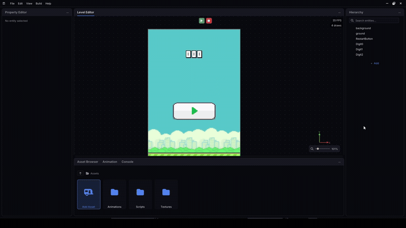
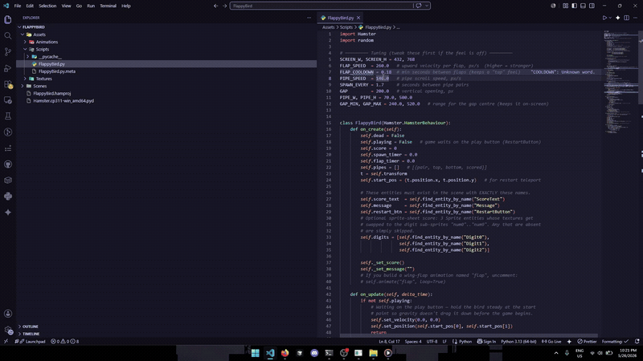
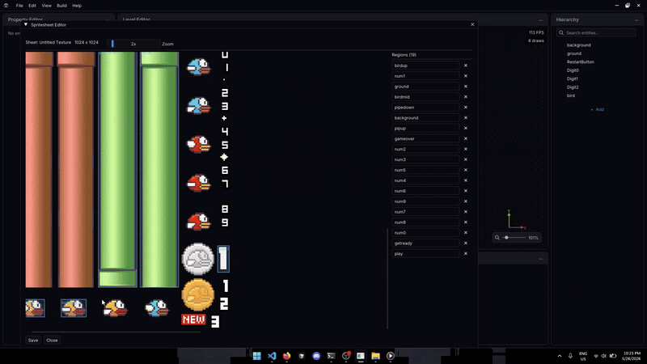

# Hamster

**A 2D game engine with an embedded Python scripting layer and a full visual editor.** Author gameplay in Python against a native C++ runtime — ECS, OpenGL rendering, Box2D physics — and build scenes in a custom Dear ImGui editor, then press Play to run the game in its own window.


<!-- Live demo: [link] -->

> Hamster started as a tool for teaching beginners Python by writing small games — that "scripting must stay dead-simple" constraint shaped the whole engine. It's a personal engineering project; the focus below is the systems work.

## Demo

<!-- Replace the GIFs in docs/ — capture instructions are in the project notes. -->

|  |  |
|:--:|:--:|
| **Scene editor** — hierarchy, property panel, gizmo drag/resize, asset browser | **Play mode** — popout game window, Box2D physics, scripted movement |
|  |  |
| **Python scripting** — write a `HamsterBehaviour`, attach it, press Play | **Spritesheet + animation** — slice a sheet, build a keyframe timeline |
|  |  |

## What a Hamster script looks like

Gameplay lives in Python. A script subclasses `HamsterBehaviour`; the C++ runtime instantiates it per entity and drives it with per-frame and event callbacks. Scripts call back into the engine for input, physics, transforms, and entity lookup.

```python
import Hamster

class Player(Hamster.HamsterBehaviour):
    def on_create(self):
        self.speed = 600.0

    def on_update(self, delta_time):
        if self.key_pressed(Hamster.key_code.D):
            self.apply_force(self.speed, 0.0)
        if self.key_pressed(Hamster.key_code.A):
            self.apply_force(-self.speed, 0.0)

    def on_collision(self, other):
        self.log("hit something")
```

## Features

**Rendering**
- OpenGL 4.0 sprite renderer with same-texture **batching** (collapses N draws into one `glDrawArrays`)
- Separate anchored **screen-space UI pass** with a baked glyph atlas for in-game text
- Quadtree **spatial index** over the ECS for viewport culling and O(log n + k) cursor picking
- Camera pan/zoom, pixel-art nearest filtering, per-sprite tint and UV sub-rects

**Simulation**
- **Entity-component-system** via EnTT (Transform, Sprite, Rigidbody, Animation, Behaviour, UI components)
- **Box2D 3.x physics** — gravity, forces/impulses, velocity, static/dynamic/kinematic bodies, box & circle colliders with density/friction/restitution
- Time-based **sprite animation** with a keyframe timeline and `.hanim` format
- Parent/child **entity hierarchy** with cascading destroy

**Python scripting (pybind11)**
- Embedded CPython interpreter; C++ drives Python via `on_create` / `on_update` / `on_collision` / `on_animation_complete` / `on_button_clicked`
- Python calls back for input, physics, transforms, logging, animation, and runtime entity create/destroy/lookup
- User scripts hot-load from the project directory, including subpackages (`enemies/boss.py` → `import enemies.boss`)

**Editor (Hamster-Wheel)**
- Dockless ImGui editor: hierarchy, property editor, asset browser, console, spritesheet slicer, animation timeline, project hub
- Entity picking, transform gizmos, 8-handle resize, context menus
- **Non-destructive play mode** — scene state is snapshotted on Play and fully restored on Stop (Unity-style)
- **Popout play window** sized to the project's target resolution, with input routed to it
- Asset identity via `.meta` **sidecars** that survive renames; a Win32 file watcher syncs external changes live
- Spritesheet slicing into named sub-sprites; a `Sprite` references a whole texture or a sub-sprite through one UUID

**Packaging**
- Standalone **Windows installer** (Inno Setup) that runs on a machine with **no Python and no Visual Studio** — CPython is bundled via the official embeddable package and the MSVC runtime ships app-local

**Not implemented / out of scope:** audio, networking, 3D, lighting, and a standalone runtime-only player (the editor hosts play mode today).

## Tech stack

| | |
|---|---|
| **Language** | C++20 (engine), Python 3.11 (gameplay scripts) |
| **Graphics** | OpenGL 4.0 via GLAD; Dear ImGui (editor UI) |
| **Bindings** | pybind11 (embedded interpreter + C++↔Python module) |
| **ECS** | EnTT |
| **Physics** | Box2D 3.0.1 |
| **Math / windowing / images** | GLM, GLFW, stb_image |
| **Misc** | tinyfiledialogs, Boost (UUID only) |
| **Build** | CMake 3.28+, Ninja, clang-cl (LLVM/MSVC ABI) |
| **Tests** | CTest smoke test exercising the C++↔Python boundary |

## Architecture

Hamster is three CMake subprojects with a deliberate dependency direction:

```
Hamster-Wheel  (editor executable: ImGui panels, scene viewport, project hub)
      │  links
      ▼
Hamster-Core   (static lib: app loop, EnTT ECS, OpenGL renderer, Box2D,
      │         AssetManager, Scene/Project serialization, pybind interpreter)
      ▲  imports at runtime
      │
Hamster-Py     (pybind11 extension → Hamster.pyd: exposes C++ types to Python)
```

**Core** owns the application loop, the scene/ECS façade, the renderer, the physics world, and the embedded Python interpreter's lifecycle. **Py** is a separate pybind11 module compiled to `Hamster.pyd`, copied into each project so user scripts can `import Hamster`. **Wheel** is the editor — it links Core and renders everything through Dear ImGui.

The main loop, each frame: flush queued layer changes → `Layer::OnUpdate` (editor input, picking) → ImGui pass (all panels + the scene viewport blitted from an FBO) → `Scene::OnUpdate` (Box2D step → contact events → sync physics to transforms → animation advance → Python `on_update`) → swap buffers. Gameplay runs *after* ImGui, so script-driven transform changes appear on the next frame's render.

The **C++↔Python boundary** is one-directional by design: C++ owns the loop and calls into Python; Python calls back only through a fixed surface on `HamsterBehaviour` and the `EntityHandle` returned by lookups. A single interpreter lives for the whole process.

For the full breakdown — module map, the per-frame data flow, the binding table, asset/sidecar identity, and serialization — see [`docs/architecture.md`](docs/architecture.md).

## Building & running

**Prerequisites (Windows):** [LLVM/clang-cl](https://releases.llvm.org/), [CMake](https://cmake.org/) 3.28+, [Ninja](https://ninja-build.org/), and [Python 3.11](https://www.python.org/) (for the embedded interpreter). pybind11 and all other dependencies are vendored as submodules — no package manager needed.

```powershell
# clone with submodules
git clone --recurse-submodules https://github.com/jadenjinnn/Hamster.git
cd Hamster

# configure (Ninja + clang-cl + Python 3.11)
cmake -G "Ninja" `
  -DCMAKE_BUILD_TYPE=Debug `
  -DCMAKE_C_COMPILER="C:/Program Files/LLVM/bin/clang-cl.exe" `
  -DCMAKE_CXX_COMPILER="C:/Program Files/LLVM/bin/clang-cl.exe" `
  -DPython_ROOT_DIR="C:/Path/To/Python311" `
  -DCMAKE_CXX_FLAGS="/EHsc -Wno-unused-command-line-argument" `
  -S . -B build

# build the editor
cmake --build build --target Hamster-Wheel -j 8

# run it
.\build\Hamster-Wheel\Hamster-Wheel.exe
```

The editor opens to the **project hub** — create a project, add an entity, attach a Python script (or drop a sprite in), and press **Play**. New projects scaffold `Assets/{Textures,Scripts,Animations}` and copy in the Python module automatically.

**Smoke test** (builds the engine, embeds Python, runs one frame, exercises the bindings):

```powershell
ctest --test-dir build -R SmokeTest --output-on-failure
```

**Packaging an installer** (produces `dist/HamsterSetup.exe`, requires [Inno Setup 6](https://jrsoftware.org/isdl.php)):

```powershell
cmake --build build-release --target Hamster-Wheel Hamster -j 8   # Release build
.\Scripts\package.ps1 -MakeInstaller
```

Full build recipe and flag notes live in [`docs/build.md`](docs/build.md).

## Engineering highlights

A few problems worth calling out:

- **Interpreter lifetime across the C++/Python boundary.** Any C++ object holding a `pybind11::object` must release it *before* `Py_Finalize`, or the implicit member destruction decrefs Python objects on a dead interpreter and crashes. The fix was to make `Application`'s destructor finalize Python *last*, after explicitly releasing every pybind-holding member — a non-obvious ordering invariant that a clean exit depends on.

- **Picking and culling without GPU stalls.** Entity selection originally re-rendered the whole scene to an offscreen buffer and did a `glReadPixels` readback every frame the cursor moved — a pipeline stall. That was replaced with a per-frame quadtree spatial index over the ECS, giving O(log n + k) point-picking and viewport-rect culling; combined with same-texture sprite batching, the release build holds 60+ fps at 5,000 sprites with live hover-picking.

- **Non-destructive play mode.** Pressing Play snapshots the scene by reusing the existing stream-based serializer into an in-memory buffer; Stop restores it. The restore is deferred to the top of the next frame rather than run inline — doing it inline wiped the ECS registry mid-iteration during a script callback, a use-after-free on the EnTT view. Runtime-spawned entities, physics-moved transforms, and script-mutated state all revert cleanly.

- **A Python-free Windows install.** The engine embeds CPython, so shipping it normally requires the user to have the exact Python installed. The installer instead bundles CPython's official *embeddable* package with an isolated `._pth`, ships the MSVC runtime app-local, and a packaging script asserts a file manifest before Inno Setup packs it — so it launches and runs scripted gameplay on a machine that has never had Python or Visual Studio.

## Documentation

- [`docs/architecture.md`](docs/architecture.md) — full system design, module map, data flow
- [`docs/build.md`](docs/build.md) — toolchain, build, and packaging recipe
- Hosted guide: <https://doritothepug.github.io/Hamster>
